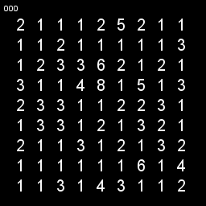
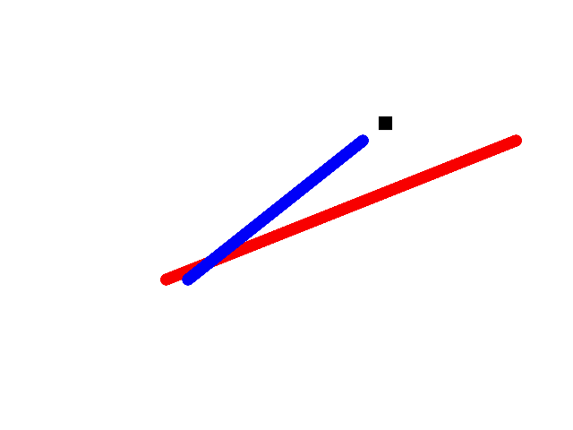
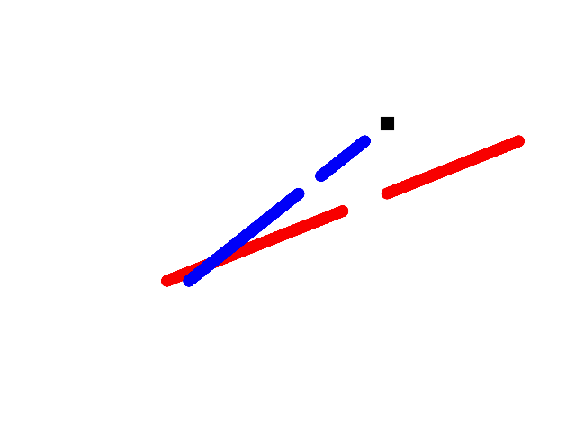

# Solving Sudoku using iterated projections

## Alternating Projections

Projections onto convex sets (POCS) is a useful method for finding the intersection between convex sets.  A simple example is shown below, where we have two convex constraint sets  (red) and  (blue).  The intersection is found by simply projecting onto each set consecutively via the iterated map:

where  are the projections onto their respective sets.  Projections are idempotent  and are distance minimizing;

 such that   is minimized.

The solution is found when

.
The convexivity of the constraints sets allows lots of general conclusions to be drawn, even if there is little knowledge about the individual sets.  Unfortunately, when the constraint sets are non-convex, very few general results hold. Consequently, rather than finding the global solution, using simple alternating projections can result in stagnation at local minima.  An example of this is shown below, where the sets from the previous example are made to be non-convex, and the ability to find the intersection (global minima) is now highly dependent on the initial guess.

Despite the loss of guarantees when the sets are no longer convex, projection methods can prove very useful and powerful for finding solutions to non-convex optimization problems.  Examples include Sudoku, the n-queens problem , graph-coloring and phase retrieval.

As I will discuss in the next section, to get projection methods to work with non-convex problems, the simple alternating projection algorithm needs to be modified.

##  The Difference Map
One of the most successful non-convex projection algorithms is the difference map (DM).  It is written as

where

,

where  and  are called estimates.
Once a fixed point has been reached,

and this implies the two estimates are equal with a solution;

Rather than the form outlined above, a simpler version of the difference map is often used and is given by;

.
This simpler version generally performs well and reduces the number of projections required per iteration.

The same non-convex problem is shown below but now using the DM algorithm.  Rather than getting trapped in the local minima, the algorithm is able to escape, search more of solution space, and finally converge onto a solution.

## References

V. Elser, 'Phase retrieval by iterated projections', J. Opt. Soc. Am. A/Vol. 20, No. 1/January 2003

V. Elser, et al. 'Searching with iterated maps' 104 (2), 418-423 (2007)
http://www.pnas.org/content/104/2/418.full.pdf

S. Gravel, V. Elser, "Divide and concur: A general approach to constraint satisfaction". Physical Review E. (2008). 78:036706. http://link.aps.org/doi/10.1103/PhysRevE.78.036706

Luke Russel D, “Relaxed averaged alternating reflections for diffraction imaging” Inverse problems, (2005) 21, 37-50

Bauschke H H, Combettes P L and Luke D R 2003 Hybrid projection–reflection method for phase retrieval
J. Opt. Soc. Am. A 20 1025–34

H.H. Bauschke, P.L. Combettes, and D.R. Luke, "Phase retrieval, error reduction algorithm, and Fienup variants: a view from convex optimization". Journal of the Optical Society of America A. (2002). 19:1334-1345

S. Marchesini, 'A unified evaluation of iterative projection algorithms for phase retrieval',  Review of Scientific Instruments 78 (2007).

